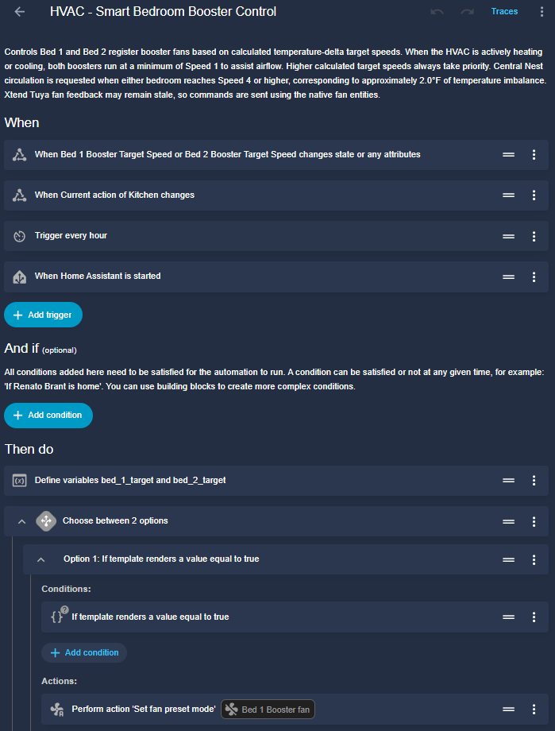
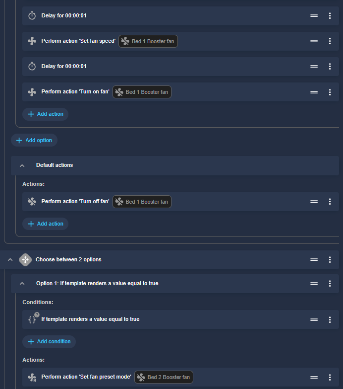
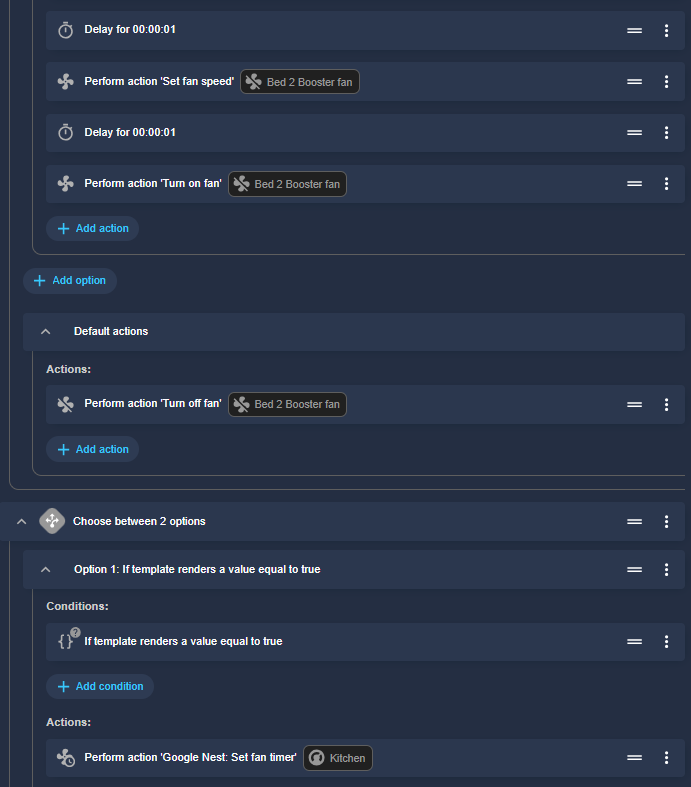
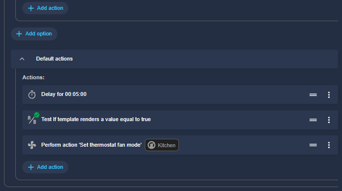

# Home Assistant Installation

This directory contains the Home Assistant configuration used by the HVAC room-balancing project.

The implementation is divided into three configuration files:

| File | Purpose |
|---|---|
| `templates.yaml` | Calculates room temperature deltas and desired booster speeds |
| `automation.yaml` | Controls the booster fans and Nest central blower |
| `dashboard.yaml` | Provides monitoring and historical visualization |

The configuration in this repository reflects the working implementation as of **August 2026**.

---

# Requirements

The current implementation requires:

- Home Assistant
- Nest thermostat integrated with Home Assistant
- Temperature sensors for the reference room and controlled rooms
- Tuya-based smart HVAC register booster fans
- Xtend Tuya custom integration
- ApexCharts Card for dashboard visualization

The implementation currently controls two bedrooms using the Kitchen as the temperature reference.

---

# Hardware Used

## HVAC Thermostat

The central HVAC system is controlled by a Nest thermostat.

Home Assistant entity:

`climate.kitchen`

The controller uses both the HVAC mode and the `hvac_action` attribute.

Relevant `hvac_action` states are:

- `cooling`
- `heating`
- `idle`

---

## Temperature Sensors

Current entities:

| Location | Entity |
|---|---|
| Kitchen | `sensor.kitchen_temp_temperature` |
| Bed 1 | `sensor.bed_1_temp_temperature` |
| Bed 2 | `sensor.bed_2_temp_temperature` |

The Kitchen sensor acts as the temperature reference.

Dedicated sensors of the same type are used in the bedrooms to improve the consistency of relative temperature measurements.

---

# Booster Fans

Two Tuya-based smart register booster fans are installed.

## Bed 1

Product:

https://amzn.to/45ns5bJ

Entity:

`fan.bed_1_booster`

## Bed 2

Product:

https://amzn.to/45ns5bJ

Entity:

`fan.bed_2_booster`

The boosters support ten speed levels.

The Home Assistant fan percentage maps directly to those levels:

| Booster Speed | HA Percentage |
|---:|---:|
| 1 | 10% |
| 2 | 20% |
| 3 | 30% |
| 4 | 40% |
| 5 | 50% |
| 6 | 60% |
| 7 | 70% |
| 8 | 80% |
| 9 | 90% |
| 10 | 100% |

---

# Tuya and Xtend Tuya

The booster fans are Tuya devices.

During the development of this project, the official Home Assistant Tuya integration did not expose the controls required to operate these specific booster fans.

For that reason, this installation uses the custom **Xtend Tuya** integration:

https://github.com/azerty9971/xtend_tuya

Xtend Tuya extends the capabilities available through the standard Tuya integration and can expose entities or functionality not otherwise available for some devices.

## Important Limitation

At the time of this implementation in August 2026, device-state feedback through Xtend Tuya was not completely reliable for these boosters.

Home Assistant could occasionally display stale values for:

- Fan percentage
- Booster speed
- Operating mode
- Related Tuya select entities

However, the functions required by this project were successfully working.

The boosters reliably received commands to:

- Set `FAN` mode
- Set fan percentage
- Turn ON
- Turn OFF
- Configure a speed while OFF
- Start directly at the configured speed

Because command execution was reliable while feedback could be stale, the project uses a **desired-state control architecture**.

Home Assistant calculates the state that the booster should have and sends that state explicitly.

Reported booster state is treated mainly as diagnostic information and is not used as the primary control feedback.

---

# Configuration Files

## `templates.yaml`

This file creates four important entities:

| Entity | Purpose |
|---|---|
| `sensor.bed_1_temperature_delta` | Bed 1 temperature relative to Kitchen |
| `sensor.bed_2_temperature_delta` | Bed 2 temperature relative to Kitchen |
| `sensor.bed_1_booster_target_speed` | Calculated Bed 1 booster target |
| `sensor.bed_2_booster_target_speed` | Calculated Bed 2 booster target |

The template logic handles:

- Cooling direction
- Heating direction
- Heat/Cool mode
- Booster speed calculation
- 0.2°F hysteresis

### Current Speed Curve

| Relevant ΔT | Target |
|---:|---:|
| `< 1.5°F` | 0 |
| `1.5 – <2.0°F` | 2 |
| `2.0 – <2.5°F` | 4 |
| `2.5 – <3.0°F` | 6 |
| `3.0 – <3.5°F` | 8 |
| `≥ 3.5°F` | 10 |

The minimum Speed 1 used while the HVAC is actively running is intentionally **not calculated in the template sensors**.

It is applied by the automation as an effective minimum.

This keeps the temperature-based target separate from HVAC assistance.

---

# `automation.yaml`

The primary automation is:

**HVAC - Smart Bedroom Booster Control**

Its responsibilities include:

- Reading both calculated target speeds
- Monitoring `hvac_action`
- Enforcing minimum Speed 1 when the HVAC is actively heating or cooling
- Setting booster operating mode
- Setting booster percentage
- Turning boosters ON and OFF
- Starting central Nest circulation
- Maintaining a five-minute post-circulation period
- Recovering after Home Assistant restarts
- Periodically reconciling the desired state






---

# Effective Booster Target

The automation distinguishes between:

**Calculated Target**

and:

**Effective Target**

The calculated target is based purely on room temperature difference.

When the HVAC is actively heating or cooling:

`Effective Target = max(Calculated Target, 1)`

Examples:

| Calculated | HVAC Action | Effective |
|---:|---|---:|
| 0 | idle | 0 |
| 0 | cooling | 1 |
| 0 | heating | 1 |
| 2 | cooling | 2 |
| 4 | cooling | 4 |
| 10 | heating | 10 |

Therefore, Speed 1 is only a minimum airflow assistance level.

A higher temperature-based target always takes priority.

---

# Booster Command Sequence

When a booster needs to operate, commands are intentionally sent in this order:

1. Set operating mode to `FAN`
2. Wait 1 second
3. Set target percentage
4. Wait 1 second
5. Turn the booster ON

Testing showed that the boosters accept mode and percentage commands while OFF.

This is useful because Home Assistant can configure the desired speed before starting the fan.

It prevents the booster from briefly starting at a previously stored higher speed.

When no airflow is required, Home Assistant sends a standard fan OFF command.

---

# Central Blower Logic

Central HVAC circulation is requested when either bedroom reaches:

**Speed 4 or greater**

With the current control curve, this corresponds to approximately:

**2.0°F of directional temperature difference**

Therefore:

| Condition | Result |
|---|---|
| Target 0 | No balancing |
| Effective S1 | HVAC-active minimum assistance |
| Target S2 | Local booster only |
| Target S4+ | Booster + central circulation |

This allows small imbalances to be handled locally without unnecessarily running the central blower.

---

# Central Blower Post-Run

When both bedrooms fall below the threshold requiring central circulation, the blower is not immediately stopped.

The automation waits:

**5 minutes**

After the delay, the target sensors are checked again.

If both still remain below Speed 4, the independent Nest fan request is cancelled.

If temperature demand returns during the delay, the automation restarts and the pending shutdown is cancelled.

The automation therefore uses:

`mode: restart`

---

# Hysteresis

The template controller uses approximately:

**0.2°F hysteresis**

This prevents small sensor fluctuations from repeatedly changing booster speeds around a threshold.

Example:

Speed 4 starts when the relevant difference reaches approximately:

**2.0°F**

but does not fall immediately when the temperature drops slightly below 2.0°F.

It must fall to approximately:

**1.8°F**

before the controller reduces the level.

The same principle is used for the other thresholds.

---

# Automation Triggers

The automation runs when:

### Calculated booster targets change

- `sensor.bed_1_booster_target_speed`
- `sensor.bed_2_booster_target_speed`

### HVAC operating action changes

The automation monitors:

`climate.kitchen`

attribute:

`hvac_action`

This is necessary so that the boosters react immediately when heating or cooling starts or stops.

### Home Assistant starts

The desired configuration is reapplied after a Home Assistant restart.

### Hourly reconciliation

The desired state is also re-applied once per hour.

This provides additional protection against:

- Missed Tuya commands
- Temporary integration issues
- Booster restarts
- Stale state
- Nest fan timer expiration

---

# Installing `templates.yaml`

This repository stores only the templates required for this project.

How they should be included depends on the existing Home Assistant configuration.

For installations using:

`template: !include templates.yaml`

merge the contents of the provided `templates.yaml` into the existing template configuration.

Do not create duplicate template sensor definitions with the same `unique_id`.

After installation, reload the Template Entities or restart Home Assistant.

Confirm that the following entities exist:

- `sensor.bed_1_temperature_delta`
- `sensor.bed_2_temperature_delta`
- `sensor.bed_1_booster_target_speed`
- `sensor.bed_2_booster_target_speed`

---

# Installing the Automation

The automation can either be:

- Added through the Home Assistant automation UI using **Edit in YAML**
- Merged into an existing `automations.yaml` configuration

Before enabling it, verify all entity IDs.

The included configuration assumes:

| Function | Entity |
|---|---|
| Nest thermostat | `climate.kitchen` |
| Kitchen temperature | `sensor.kitchen_temp_temperature` |
| Bed 1 temperature | `sensor.bed_1_temp_temperature` |
| Bed 2 temperature | `sensor.bed_2_temp_temperature` |
| Bed 1 booster | `fan.bed_1_booster` |
| Bed 2 booster | `fan.bed_2_booster` |

If your installation uses different entity IDs, update them before enabling the automation.

---

# Installing the Dashboard

The included `dashboard.yaml` contains the monitoring card developed for this project.

It uses **ApexCharts Card**.

The dashboard is intended primarily for controller analysis and tuning.

It displays:

- Bed 1 calculated booster target
- Bed 2 calculated booster target
- Bed 1 temperature delta
- Bed 2 temperature delta
- 24-hour historical behavior
- ΔT zero reference

Because both bedrooms may have exactly the same booster target at the same time, the visual configuration intentionally differentiates the speed lines.

The dashboard is diagnostic only and is not required for controller operation.

---

# Validation

After installation, verify the system progressively.

First verify temperature sensors and calculated deltas.

Then verify that calculated target speeds follow the expected curve.

Next verify each booster manually.

Expected command behavior:

- `fan.set_preset_mode`
- `fan.set_percentage`
- `fan.turn_on`
- `fan.turn_off`

Finally verify central blower control.

The expected overall behavior is:

```text
ΔT < 1.5°F
    ↓
No temperature-balancing demand

ΔT >= 1.5°F
    ↓
Local booster Speed 2

ΔT >= 2.0°F
    ↓
Booster Speed 4
+
Central circulation

Increasing ΔT
    ↓
S6 → S8 → S10
```

When the HVAC itself is actively heating or cooling:

```text
Calculated Target = 0
        +
HVAC Active
        ↓
Effective Target = Speed 1
```

---

# Important Notes

The configuration in this repository is tuned for a specific house, HVAC system and duct layout.

The thresholds should not automatically be considered ideal for another home.

Different installations may require adjustments based on:

- Room size
- Duct length
- Duct diameter
- Static pressure
- Booster performance
- HVAC airflow
- Sensor location
- Building insulation
- Solar exposure
- Climate

The dashboard is particularly useful for making these adjustments based on actual data.

---

# Safety

Register booster fans change airflow distribution through the HVAC system.

Avoid configurations that significantly restrict total system airflow.

Do not close large numbers of supply registers in an attempt to force airflow toward other rooms.

Ensure that return-air paths remain adequate.

If system static pressure, airflow requirements or equipment limitations are unknown, consult a qualified HVAC professional.

---

# Files

- [`templates.yaml`](templates.yaml) — temperature and target calculations
- [`automation.yaml`](automation.yaml) — active balancing controller
- [`dashboard.yaml`](dashboard.yaml) — monitoring and tuning interface

For the complete project description, return to the [main README](../README.md).
```

### Próximos três arquivos

Agora temos uma separação boa:

**`README.md` principal** → explica a solução.  
**`HomeAssistant/README.md`** → explica como instalar e como os componentes se relacionam.  
**YAML** → contém o código real.

O próximo passo é gerar, nesta ordem, `HomeAssistant/templates.yaml`, `HomeAssistant/automation.yaml` e `HomeAssistant/dashboard.yaml`, usando **exatamente a versão que está funcionando hoje**, sem voltar para nenhuma das curvas antigas que testamos durante o desenvolvimento. 
