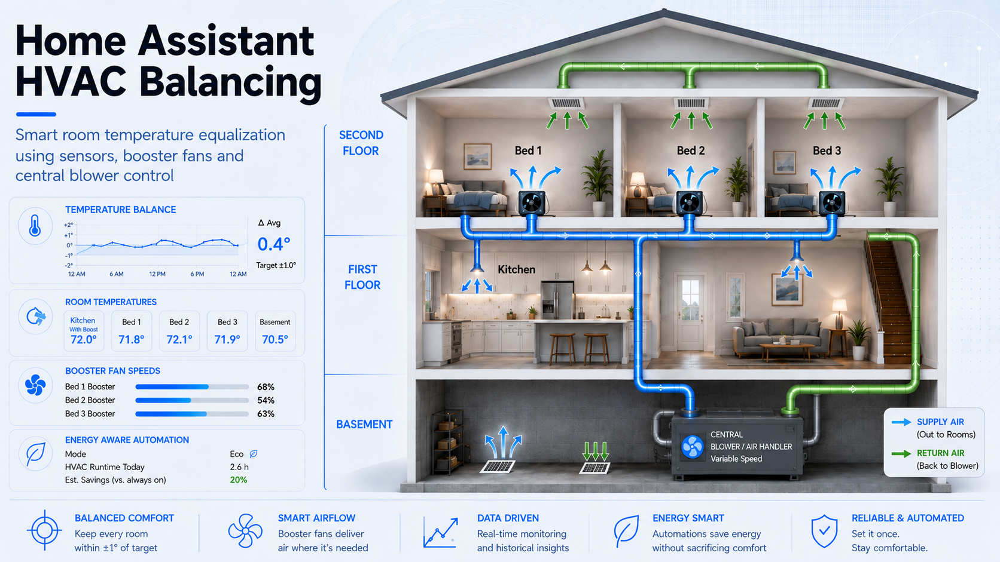
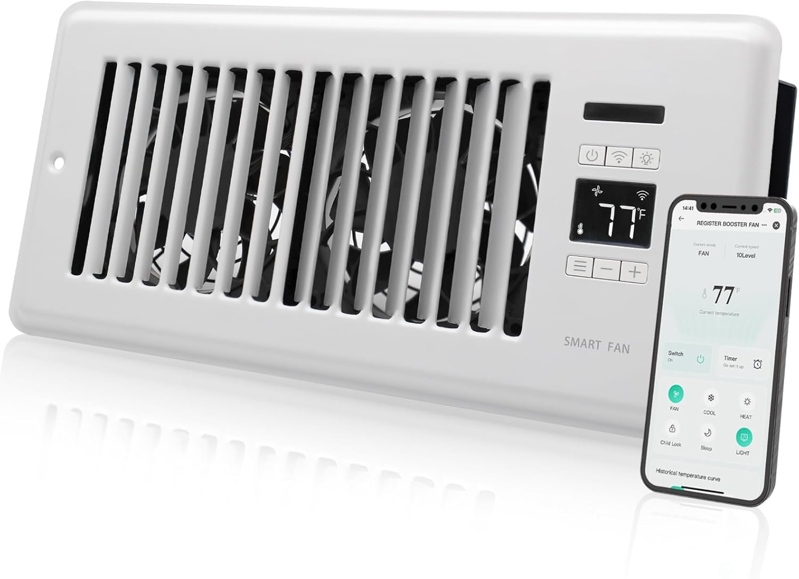
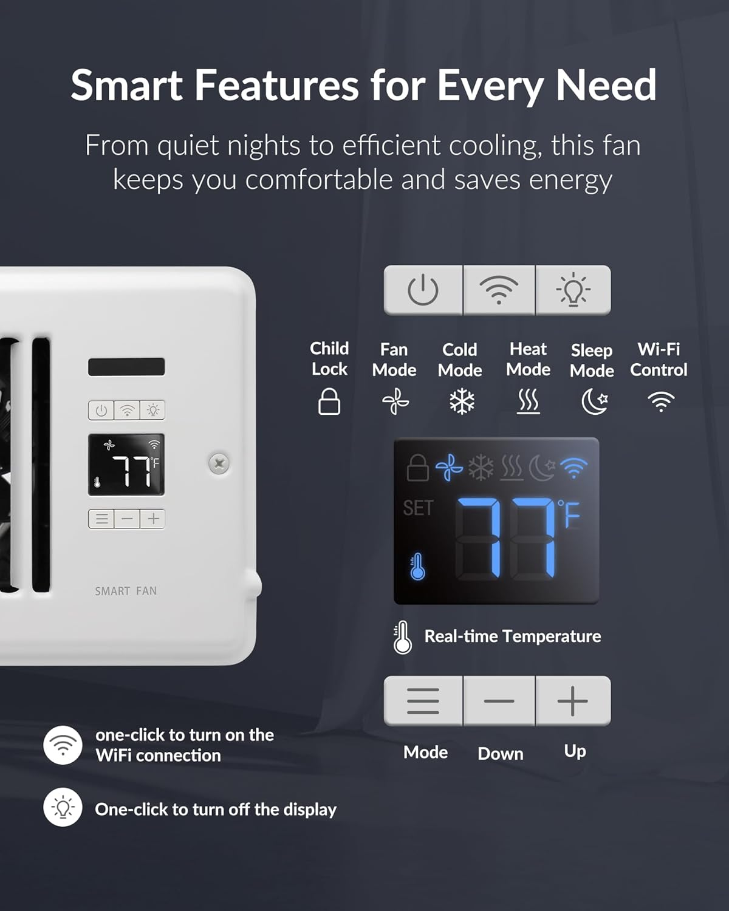
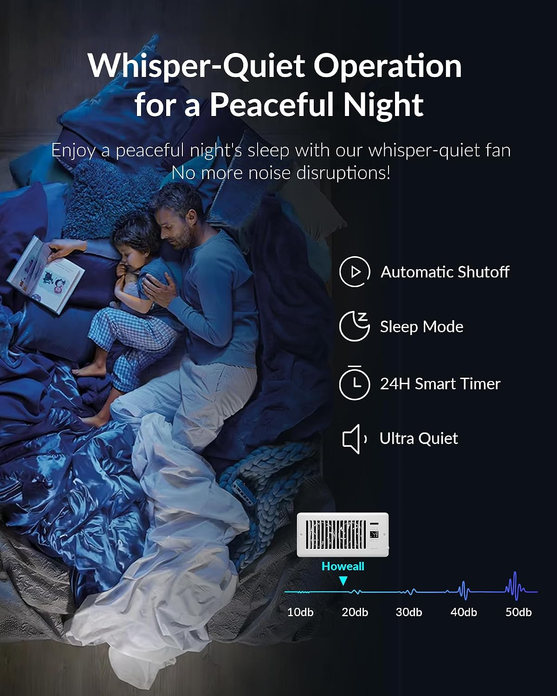
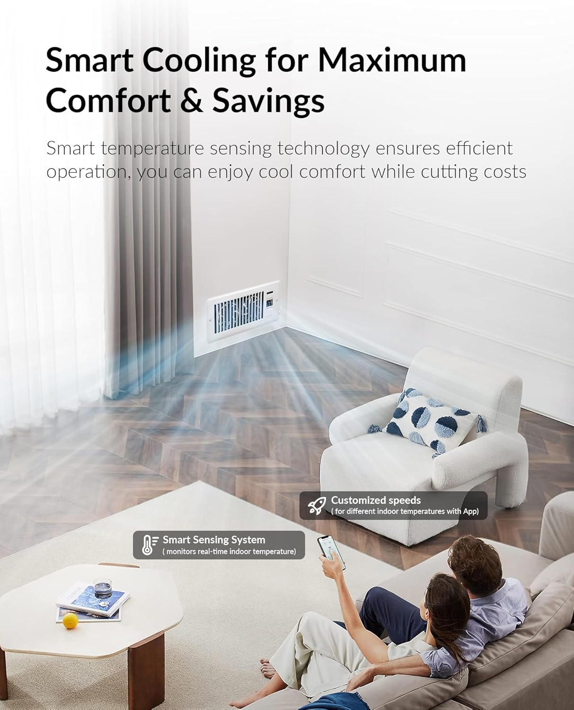
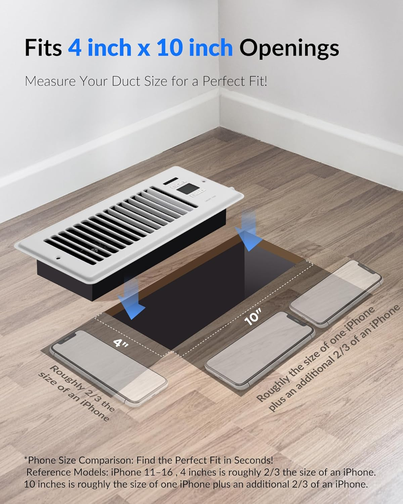

# Home Assistant HVAC Balancing



A smart HVAC room-balancing system built with Home Assistant, temperature sensors, register booster fans and central HVAC blower control.

The goal of this project is to reduce temperature differences between rooms by dynamically controlling airflow instead of relying only on additional heating or cooling cycles.

---

## The Problem

Some rooms in the house consistently become warmer or cooler than others.

The central HVAC thermostat can maintain the temperature around its reference location, but it cannot directly compensate for differences caused by:

- Different duct lengths and airflow
- Room orientation and solar exposure
- Distance from the HVAC system
- Closed bedroom doors
- Different thermal loads
- Uneven supply airflow

In this installation, the bedrooms can drift significantly from the temperature measured near the main living area.

Instead of simply running the compressor longer, this project attempts to redistribute the conditioned air already available in the house.

---

## The Solution

Home Assistant continuously compares the temperature of each bedroom against a reference temperature measured in the Kitchen.

Based on that temperature difference, it controls smart register booster fans installed in the bedrooms.

For small differences, the system can use only the local booster.

For larger differences, Home Assistant also activates the central HVAC blower to increase airflow through the duct system.

The booster speed increases progressively as the temperature imbalance becomes larger.

The existing Nest thermostat continues to control normal heating and cooling.

Home Assistant acts as an additional **airflow-balancing layer**.

---

## System Overview

```text
                    ┌──────────────────────┐
                    │    Nest Thermostat   │
                    │                      │
                    │ Heating / Cooling    │
                    │ Central Blower       │
                    └──────────┬───────────┘
                               │
                               │
                    ┌──────────▼───────────┐
                    │    Home Assistant    │
                    │                      │
                    │  Temperature Delta   │
                    │  Hysteresis          │
                    │  Booster Control     │
                    │  Blower Control      │
                    └───────┬──────┬───────┘
                            │      │
               ┌────────────┘      └────────────┐
               │                                │
        ┌──────▼──────┐                  ┌──────▼──────┐
        │    Bed 1    │                  │    Bed 2    │
        │             │                  │             │
        │ Temp Sensor │                  │ Temp Sensor │
        │ Booster Fan │                  │ Booster Fan │
        └─────────────┘                  └─────────────┘

                    Temperature Reference
                              │
                       ┌──────▼──────┐
                       │   Kitchen   │
                       │ Temp Sensor │
                       └─────────────┘
```

---

## Register Booster Fans

Two smart HVAC register booster fans are installed in the bedrooms.

### Bed 1

[Amazon product page](https://amzn.to/45ns5bJ)

### Bed 2

[Amazon product page](https://amzn.to/45ns5bJ)

The boosters provide 10 selectable speed levels and are controlled individually by Home Assistant.

### Booster Fan Photos

<p align="center">
  
  
  
</p>

<p align="center">
  
  
  
</p>

<p align="center">
  
</p>

---

## Tuya Integration

The booster fans are Tuya-based Wi-Fi devices.

They work normally with the Tuya/Smart Life ecosystem, but during this implementation the **official Home Assistant Tuya integration did not expose the controls required to properly operate this particular booster fan model**.

For this reason, the project uses **Xtend Tuya** instead.

### What is Xtend Tuya?

Xtend Tuya is a custom Home Assistant integration designed to extend the official Tuya integration by exposing entities and capabilities that are missing from the standard integration.

Project repository:

[azerty9971/xtend_tuya on GitHub](https://github.com/azerty9971/xtend_tuya)

Xtend Tuya is not part of Home Assistant Core. It works as an extension around the Tuya integration and uses mechanisms that are not officially supported by the Home Assistant Core project.

In this installation, Xtend Tuya exposed the booster fan controls required by the balancing system.

---

## Xtend Tuya Limitations Observed

At the time this project was implemented in **August 2026**, Xtend Tuya was functional for controlling these boosters, but the integration was not completely reliable in terms of device-state feedback.

The most noticeable issue was that Home Assistant could sometimes display stale information for values such as:

- Current fan speed
- Fan percentage
- Operating/preset mode
- Some Tuya select entities

For example, the physical booster could be operating at Speed 1 while Home Assistant still reported a previously selected higher speed.

Likewise, the physical device and the Tuya application could show the correct operating mode while the corresponding Home Assistant entity still displayed the previous state.

This made the reported state unsuitable as the primary feedback signal for the controller.

However, **command delivery worked reliably for the functions required by this project**.

The following operations were successfully tested:

- Set booster operating mode to `FAN`
- Set fan percentage / booster speed
- Turn the booster ON
- Turn the booster OFF
- Configure a new speed while the booster was OFF
- Turn the booster ON directly at the previously configured speed

This was sufficient for the balancing controller.

---

## Control Strategy: Desired State Instead of Reported State

Because command execution was reliable but status feedback could be stale, the controller does not depend on the booster-reported speed to determine what should happen next.

Instead, Home Assistant calculates the desired state independently.

The controller determines:

1. The current room temperature difference
2. The required booster speed
3. Whether central HVAC circulation is required
4. The command that should be sent to each booster

The booster is then commanded directly to that desired state.

In other words:

**Home Assistant is the source of truth for the requested booster state.**

The reported Tuya state is treated mainly as diagnostic information.

This is also why the system maintains separate calculated entities for the desired booster speeds instead of relying on the percentage or mode reported by the physical fan.

---

## Booster Command Sequence

Testing showed that the boosters accept mode and speed commands even while they are turned off.

This made it possible to prepare the desired state before starting the fan.

The controller therefore uses the following sequence whenever a booster needs to run:

1. Set operating mode to `FAN`
2. Wait briefly for the Tuya device to process the command
3. Set the desired fan percentage
4. Wait briefly again
5. Turn the booster ON

The 10 physical booster speed levels map directly to Home Assistant fan percentages:

| Booster Level | Fan Percentage |
|---:|---:|
| 1 | 10% |
| 2 | 20% |
| 3 | 30% |
| 4 | 40% |
| 5 | 50% |
| 6 | 60% |
| 7 | 70% |
| 8 | 80% |
| 9 | 90% |
| 10 | 100% |

Preparing the speed before turning the fan on also prevents the booster from temporarily starting at a previously stored high speed.

If no airflow is required, Home Assistant simply sends an OFF command.

---

## Reliability Strategy

Since Tuya state feedback cannot currently be assumed to be completely reliable for these devices, the automation also periodically re-applies the desired state.

This provides a simple reconciliation mechanism in case of:

- A missed Tuya command
- A temporary cloud/integration communication problem
- A booster reboot
- Home Assistant restart
- Stale device state

The system therefore follows a **desired-state control model** rather than a strict closed-loop controller based on the state reported by the booster itself.

If Xtend Tuya state feedback becomes fully reliable in a future release, the architecture could be expanded to compare commanded and actual booster states and detect failed commands automatically.

---

## Temperature Reference

The Kitchen temperature sensor is used as the reference for room balancing.

Current temperature entities:

| Location | Home Assistant Entity |
|---|---|
| Kitchen | `sensor.kitchen_temp_temperature` |
| Bed 1 | `sensor.bed_1_temp_temperature` |
| Bed 2 | `sensor.bed_2_temp_temperature` |

Using similar dedicated temperature sensors in all three locations provides a better relative comparison than mixing different temperature measurement technologies.

---

## Temperature Delta

Home Assistant calculates a temperature delta for each bedroom.

The basic relationship is:

**Temperature Delta = Bedroom Temperature − Kitchen Temperature**

Therefore:

| Delta | Meaning |
|---:|---|
| Positive | Bedroom is warmer than Kitchen |
| 0°F | Temperatures are equal |
| Negative | Bedroom is cooler than Kitchen |

The controller interprets this delta differently depending on whether the HVAC system is heating or cooling.

During cooling, a bedroom warmer than the Kitchen creates demand.

During heating, a bedroom colder than the Kitchen creates demand.

---

## Current Booster Control Curve

Initial testing used a conservative control curve.

That approach worked, but temperature equalization was too slow and the boosters rarely operated above the lower speeds.

The controller was therefore tuned to use the booster capacity more aggressively.

| Relevant Temperature Difference | Booster Command |
|---:|---:|
| `< 1.5°F` | OFF |
| `1.5 – <2.0°F` | Speed 2 |
| `2.0 – <2.5°F` | Speed 4 |
| `2.5 – <3.0°F` | Speed 6 |
| `3.0 – <3.5°F` | Speed 8 |
| `≥ 3.5°F` | Speed 10 |

This curve allows the system to react substantially faster when a room begins moving away from the reference temperature.

---

## HVAC Active Minimum Speed

When the central HVAC system is actively heating or cooling, both bedroom boosters operate at a minimum of **Speed 1**.

This helps conditioned air reach the bedrooms whenever the HVAC is already operating.

Speed 1 is only a minimum.

If the temperature delta requests a higher speed, the calculated speed always takes priority.

For example:

| HVAC | Calculated Target | Booster Command |
|---|---:|---:|
| Idle | 0 | OFF |
| Cooling | 0 | Speed 1 |
| Heating | 0 | Speed 1 |
| Cooling | Speed 2 | Speed 2 |
| Cooling | Speed 6 | Speed 6 |
| Heating | Speed 10 | Speed 10 |

---

## Central Blower Assistance

The local booster alone is used for smaller temperature differences.

When the imbalance reaches approximately **2°F**, Home Assistant also requests central HVAC circulation.

With the current control curve, this corresponds to **Speed 4 or greater**.

The control strategy therefore becomes:

| Temperature Difference | Action |
|---:|---|
| `< 1.5°F` | No balancing request |
| `1.5°F` | Local booster |
| `2.0°F` | Booster + central blower |
| `2.5°F` | Higher booster speed + central blower |
| `3.0°F` | Higher booster speed + central blower |
| `3.5°F+` | Maximum booster speed + central blower |

This creates two levels of airflow correction:

**Local correction** using the register booster, followed by **whole-system circulation assistance** when the imbalance becomes larger.

---

## Hysteresis

Temperature sensors naturally fluctuate by small amounts.

Without protection, a value moving repeatedly around a threshold could cause commands such as:

`Speed 2 → Speed 4 → Speed 2 → Speed 4`

The controller therefore includes approximately **0.2°F of hysteresis**.

For example, Speed 4 may start when the temperature difference reaches 2.0°F, but it does not immediately fall back to Speed 2 when the temperature drops slightly below 2.0°F.

The temperature must fall farther before the lower speed is selected.

This significantly reduces unnecessary switching and command traffic.

---

## Post-Circulation

When neither bedroom requires central blower assistance anymore, the central fan is not immediately stopped.

The controller maintains circulation for an additional **5 minutes**.

This allows conditioned air already present in the duct system and throughout the house to continue redistributing before circulation stops.

If new demand appears during those five minutes, the pending shutdown is cancelled.

---

## HVAC Integration

The existing Nest thermostat remains responsible for normal HVAC operation.

Home Assistant monitors both the selected HVAC mode and the current `hvac_action`.

The system recognizes actual operating states such as:

- `cooling`
- `heating`
- `idle`

This is also how the controller knows when the HVAC-active minimum booster Speed 1 should be applied.

---

## Energy Considerations

Energy monitoring during development showed that the outdoor AC equipment and the indoor HVAC blower are on different monitored electrical circuits.

In this installation, observed power consumption was roughly in these ranges:

| Operating Component | Observed Power |
|---|---:|
| Central circulation blower | ~200 W |
| Indoor blower during active cooling | ~280 W at one observed point |
| Outdoor AC compressor/condenser | ~2 kW or more |

These measurements are specific to this installation and should not be considered universal HVAC specifications.

They did reveal an important characteristic of this system:

> Moving conditioned air through the house is significantly less energy-intensive than producing additional cooling with the compressor.

This makes intelligent circulation an interesting tool for improving comfort and potentially reducing unnecessary compressor runtime.

---

## Monitoring

A dedicated Home Assistant dashboard was created to observe the behavior of the balancing controller.

The dashboard tracks:

- Bedroom temperature deltas
- Calculated booster speeds
- HVAC operation
- Central blower activity
- Temperature equalization over time

ApexCharts is used for historical visualization.

This has been especially useful for tuning the booster speed curve and determining whether changes actually improve equalization time.

---

# Real-World System Behavior

The following screenshots show the system operating in the actual Home Assistant installation.

They are useful for understanding how the calculated temperature imbalance, booster commands and HVAC operation interact over time.

---

## Live System Status


The **HVAC Smart Booster - Live Status** card provides a real-time overview of the main variables used by the controller.

It shows the current Nest HVAC state together with the reference and bedroom temperatures.

For each bedroom, the dashboard displays:

- Current room temperature
- Temperature delta relative to the Kitchen
- Calculated booster target speed
- Booster fan entity state

The Nest section also shows `hvac_action` and the current blower state.

This makes the card particularly useful when validating the controller in real time.

For example, during cooling, a positive bedroom ΔT means that the bedroom is warmer than the Kitchen and therefore requires additional airflow.

The **Commanded Speed** shown for each bedroom comes from the calculated target-speed template sensor.

One important detail is that this value represents the **temperature-based target**, not necessarily the final effective command sent to the fan.

When the HVAC is actively heating or cooling, the automation imposes a minimum booster Speed 1 even if the calculated target is zero.

Therefore, it is possible to see:

`Commanded Speed = 0`

while the physical booster is intentionally operating at:

`Speed 1`

This is expected behavior.

Also, because Xtend Tuya feedback can occasionally remain stale, the state reported by the fan entity should not always be interpreted as authoritative physical-device feedback.

The controller itself uses the calculated desired state as its primary source of truth.

---

## Booster Controller


The **Booster Controller** graph is the most useful visualization for understanding the control algorithm itself.

It compares the temperature delta of both bedrooms against the booster target calculated by Home Assistant.

The graph uses two Y axes:

**Left axis — Booster Speed**

`0 → 10`

**Right axis — Temperature Delta**

`-5°F → +5°F`

Bed 1 is represented in yellow and Bed 2 in orange.

The temperature-delta lines are continuous, while the booster commands appear as steps because the controller selects discrete speed levels.

With the current control curve, the relationship is:

| Directional Temperature Difference | Booster Target |
|---:|---:|
| `< 1.5°F` | OFF |
| `1.5 – <2.0°F` | Speed 2 |
| `2.0 – <2.5°F` | Speed 4 |
| `2.5 – <3.0°F` | Speed 6 |
| `3.0 – <3.5°F` | Speed 8 |
| `≥ 3.5°F` | Speed 10 |

The graph therefore makes it possible to visually confirm that booster speed increases as the room moves farther away from the reference temperature.

It also makes the hysteresis behavior visible.

For example, once Speed 4 has been reached at approximately 2.0°F of imbalance, the controller does not immediately drop back to Speed 2 when the temperature falls slightly below 2.0°F.

The difference must fall to approximately 1.8°F before the lower level is selected.

This prevents rapid oscillation between adjacent speeds.

### Visual separation of equal booster speeds

Both bedrooms frequently require the same booster speed at the same time.

Without any visual adjustment, the two step lines would overlap completely and one would hide the other.

For visualization only, the graph applies a very small offset:

`Bed 1 = displayed 0.12 below the real level`

`Bed 2 = displayed 0.12 above the real level`

For example, when both calculated targets are Speed 4, the plotted positions are approximately:

`Bed 1 → 3.88`

`Bed 2 → 4.12`

The actual target value remains **Speed 4 for both rooms**.

This offset affects only the graph and has absolutely no effect on the automation or fan commands.

The exact raw target is still shown in the ApexCharts header.

The horizontal white reference line represents:

`ΔT = 0°F`

At this point, the bedroom and Kitchen temperatures are equal.

---

## Temperature Balance


The **Temperature Balance** graph provides the long-term view of whether the control strategy is actually accomplishing its objective.

It displays the last **48 hours** of temperature data for:

**Kitchen — red**

**Bed 1 — yellow**

**Bed 2 — orange**

The bedroom temperature deltas are also plotted using a secondary Y axis.

The main temperature axis covers:

`65°F → 85°F`

while the delta axis covers:

`-5°F → +5°F`

Because this graph covers a longer period, measurements are averaged into **10-minute intervals** to make the overall thermal behavior easier to see.

The most important information in this graph is not simply the absolute room temperature.

The objective is to observe how closely the bedroom curves follow the Kitchen temperature over time.

A successful balancing strategy should generally result in:

**smaller temperature differences and shorter periods of significant room imbalance.**

The ΔT curves provide an even clearer view.

A value near:

`0°F`

means the room is closely balanced with the Kitchen.

During cooling:

`positive ΔT`

means the bedroom is warmer than the Kitchen.

During heating:

`negative raw ΔT`

means the bedroom is cooler than the Kitchen.

The controller internally accounts for heating versus cooling direction when determining booster demand.

This graph is especially useful when tuning the system because changes to booster thresholds, central circulation or fan speeds can be compared against the resulting equalization time.

For example, after changing from the original conservative booster strategy to the current more aggressive speed curve, this graph can be used to determine whether temperature differences return toward zero more quickly.

---

## What the Three Views Show Together

These three views represent different layers of the same control system.

**Live Status** shows what the system is doing right now.

**Booster Controller** shows why a particular booster speed was selected.

**Temperature Balance** shows whether those control decisions are actually improving room temperature equalization over time.

Together they provide a practical way to tune the controller using real measured behavior rather than relying only on theoretical thresholds.

## Home Assistant Configuration

The actual YAML configuration is intentionally kept outside this README to keep the project documentation readable.

| File | Purpose |
|---|---|
| [`HomeAssistant/templates.yaml`](HomeAssistant/templates.yaml) | Temperature delta and booster target calculations |
| [`HomeAssistant/automation.yaml`](HomeAssistant/automation.yaml) | Booster and central blower control |
| [`HomeAssistant/dashboard.yaml`](HomeAssistant/dashboard.yaml) | Monitoring dashboard |
| [`HomeAssistant/README.md`](HomeAssistant/README.md) | Installation and configuration notes |

---

## Repository Structure

```text
home-assistant-hvac-balancing/
│
├── README.md
│
├── Photos/
│   └── home-assistant-hvac-balancing.png
│
└── HomeAssistant/
    ├── README.md
    ├── templates.yaml
    ├── automation.yaml
    └── dashboard.yaml
```

---

# Current Status

The HVAC balancing system is currently operational and has been field-tested during **summer cooling conditions**.

The current implementation should therefore be considered the first production version of the project:

> **Summer / Cooling Balancing**

The primary problem addressed by this version is the tendency of the upstairs bedrooms to become warmer than the Kitchen and main living areas during air-conditioning operation.

Two smart register booster fans are currently installed:

- Bed 1
- Bed 2

The Kitchen temperature sensor is used as the main reference for the balancing algorithm.

---

## Current Summer Configuration

During cooling operation, Home Assistant continuously compares each bedroom temperature against the Kitchen reference temperature.

A warmer bedroom creates a positive temperature imbalance and therefore additional airflow demand.

The system can respond at several levels:

1. No balancing action
2. Local booster airflow
3. Increased booster speed
4. Booster airflow combined with central HVAC circulation

The objective is to use additional airflow before relying on additional compressor runtime whenever possible.

---

## Current Temperature Inputs

The controller currently uses:

| Location | Function |
|---|---|
| Kitchen | Main temperature reference |
| Bed 1 | Controlled upstairs room |
| Bed 2 | Controlled upstairs room |

The raw temperature difference is calculated as:

**Bedroom Temperature − Kitchen Temperature**

During cooling, a positive value means that the bedroom is warmer than the Kitchen and additional airflow may be required.

---

## Current Booster Control

The bedroom boosters are independently controlled according to the temperature imbalance.

The current summer control curve is:

| Directional Temperature Difference | Booster Target |
|---:|---:|
| `< 1.5°F` | OFF |
| `1.5 – <2.0°F` | Speed 2 |
| `2.0 – <2.5°F` | Speed 4 |
| `2.5 – <3.0°F` | Speed 6 |
| `3.0 – <3.5°F` | Speed 8 |
| `≥ 3.5°F` | Speed 10 |

The original implementation used a more conservative speed strategy.

Real-world testing showed that room equalization was too slow and the boosters rarely used their available airflow capacity.

The current curve was therefore made more aggressive.

---

## HVAC-Active Assistance

Whenever the central HVAC system is actively cooling, both bedroom boosters operate at a minimum of **Speed 1**.

This means that conditioned air already being produced by the HVAC system receives at least a small amount of assistance reaching the upstairs bedrooms.

The Speed 1 rule acts only as a minimum.

If the calculated room imbalance requires Speed 2, 4, 6, 8 or 10, the higher value takes priority.

---

## Central Blower Assistance

Local booster airflow is used first.

When either bedroom reaches a calculated target of **Speed 4 or greater**, Home Assistant also requests central HVAC blower circulation.

With the current summer control curve, this happens at approximately:

**2.0°F of directional temperature imbalance**

This creates two balancing stages:

**Local airflow correction**

followed by:

**Local booster + whole-house circulation**

when the imbalance becomes larger.

---

## Anti-Oscillation Control

The current implementation includes approximately **0.2°F of hysteresis** around the booster speed thresholds.

This prevents small temperature fluctuations from repeatedly changing speeds.

For example:

- Speed 4 begins around 2.0°F
- The controller does not return to Speed 2 until the imbalance falls to approximately 1.8°F

This behavior significantly reduces unnecessary switching and repeated Tuya commands.

---

## Post-Circulation

When neither bedroom requires central blower assistance anymore, the Nest circulation request is not immediately cancelled.

The controller waits an additional:

**5 minutes**

and then checks the current demand again.

If both rooms remain below the central circulation threshold, the independent blower request is cancelled.

If demand returns during that period, the automation restarts and the pending shutdown is cancelled.

---

## Desired-State Fan Control

The booster fans are Tuya-based devices controlled through Xtend Tuya.

During implementation, command execution proved sufficiently reliable for the required operations, while some device-state feedback could remain stale.

For that reason, Home Assistant currently operates as the source of truth for the desired fan state.

The automation explicitly commands:

- `FAN` operating mode
- Fan percentage
- Fan ON
- Fan OFF

It does not require the reported booster percentage or mode to be correct before making the next control decision.

---

## Automatic Recovery and Reconciliation

The controller includes several mechanisms intended to maintain the desired state.

It reacts immediately when:

- Bed 1 calculated target changes
- Bed 2 calculated target changes
- HVAC `hvac_action` changes

It also runs:

- At Home Assistant startup
- Once per hour as a reconciliation cycle

The periodic cycle helps recover from situations such as a missed Tuya command, device restart or temporary integration problem.

---

## Monitoring

The current implementation includes a dedicated Home Assistant dashboard for monitoring and tuning.

The dashboard provides:

- Current HVAC state
- Kitchen temperature
- Bedroom temperatures
- Temperature deltas
- Calculated booster targets
- Booster activity
- Central blower activity
- Commanded versus reported Xtend Tuya state
- 24-hour and 48-hour historical trends

ApexCharts is used to analyze how temperature imbalance evolves and how the controller reacts.

The most important metric is not simply room temperature, but how quickly the bedroom temperature difference returns toward zero after the controller responds.

---

## Energy Monitoring

The HVAC system is also monitored electrically.

Testing showed that the central indoor blower consumes substantially less power than the outdoor AC compressor/condenser.

This supports the idea of using controlled air redistribution as an intermediate strategy before additional compressor operation whenever conditions allow.

Exact consumption values are specific to this installation and are used primarily for comparative analysis.

---

## Seasonal Scope

Although some of the underlying template logic already recognizes both cooling and heating directions, **the current physical system and controller tuning have only been validated for summer operation**.

The current installation therefore should not yet be considered a completed year-round HVAC balancing system.

The summer problem is primarily:

**Upstairs bedrooms becoming too warm**

and the current solution is:

**Increase conditioned airflow to the upstairs bedrooms.**

Winter introduces a different thermal distribution problem and will require additional field testing and likely additional hardware.

---

## Current Implementation Checklist

### Summer / Cooling

- [x] Kitchen reference temperature
- [x] Bed 1 temperature monitoring
- [x] Bed 2 temperature monitoring
- [x] Bedroom temperature-delta calculation
- [x] Cooling directional-error calculation
- [x] Dynamic booster speed control
- [x] Ten-level booster capability
- [x] Summer speed curve tuned from real-world data
- [x] Minimum Speed 1 while HVAC is actively cooling
- [x] Central blower assistance starting at Speed 4
- [x] 0.2°F hysteresis
- [x] Five-minute post-circulation
- [x] Home Assistant restart recovery
- [x] Hourly desired-state reconciliation
- [x] Xtend Tuya command validation
- [x] Xtend Tuya feedback diagnostics
- [x] Historical ApexCharts monitoring
- [x] HVAC electrical monitoring
- [x] Real-world summer operation validated

### Winter / Heating

- [ ] Winter thermal behavior measured
- [ ] Basement heating imbalance characterized
- [ ] Basement booster evaluated
- [ ] Basement booster installed if required
- [ ] Heating-specific control thresholds validated
- [ ] Heating-specific booster curve tuned
- [ ] Central circulation strategy validated for heating
- [ ] Interaction between upstairs and basement balancing tested
- [ ] Winter energy impact measured
- [ ] Full heating configuration field-tested

---

# Future Development

The next major phase of this project is to evolve the current summer controller into a **season-aware, whole-house HVAC balancing system**.

The goal is not simply to reuse the summer settings during winter.

Cooling and heating create different thermal patterns in the house, so each operating mode should eventually have its own experimentally validated balancing strategy.

---

## Phase 2 — Winter / Heating Balancing

The main winter problem is expected to be different from the summer condition.

During summer:

**Upstairs bedrooms tend to become too warm.**

During winter:

**The basement tends to become significantly colder than the rest of the house.**

This means that the winter system may need to direct additional conditioned airflow downward instead of primarily assisting the upstairs bedrooms.

The expected winter architecture is:

```text
                         HVAC MODE
                            │
                 ┌──────────┴──────────┐
                 │                     │
              COOLING               HEATING
                 │                     │
                 ▼                     ▼
       Upstairs balancing      Whole-house / basement
                 │               heating balancing
          Bed 1 Booster                │
          Bed 2 Booster         Basement Booster
                 │                     │
                 └──────────┬──────────┘
                            │
                            ▼
                     Central Blower
```

---

## Basement Booster

One of the first winter experiments will be determining whether a register booster fan should be installed in the basement.

The expected purpose of the basement booster would be to increase warm supply airflow when the basement is colder than the Kitchen reference.

A possible future entity could be:

`fan.basement_booster`

with a corresponding calculated target such as:

`sensor.basement_booster_target_speed`

The final hardware decision should be based on actual winter measurements rather than assuming that the summer strategy can simply be inverted.

---

## Basement Temperature Delta

A future winter controller would likely introduce a basement balancing variable based on:

**Kitchen Temperature − Basement Temperature**

during heating.

For example:

| Heating Difference | Possible Initial Target |
|---:|---:|
| `< 1.5°F` | OFF |
| `1.5 – <2.0°F` | Speed 2 |
| `2.0 – <2.5°F` | Speed 4 |
| `2.5 – <3.0°F` | Speed 6 |
| `3.0 – <3.5°F` | Speed 8 |
| `≥ 3.5°F` | Speed 10 |

These values are only an initial hypothesis.

They should not be considered the final winter configuration until actual heating-season data has been collected.

The basement may require a completely different curve because its duct length, heat loss, room volume and thermal behavior differ from the upstairs bedrooms.

---

## Separate Cooling and Heating Profiles

The long-term controller should maintain separate seasonal profiles.

For example:

### Cooling Profile

Optimized for:

- Warm upstairs bedrooms
- Increased upstairs airflow
- Bedroom booster control
- Central circulation for larger upstairs imbalances

### Heating Profile

Optimized for:

- Cold basement conditions
- Increased basement supply airflow
- Possibly different upstairs behavior
- Different central circulation thresholds
- Different booster speed curves

The controller should automatically select the appropriate strategy based on the HVAC operating mode.

---

## Heating While HVAC Is Idle

One area that requires specific winter testing is whether circulation should be requested while the furnace is not actively heating.

During cooling, circulating already-cooled air can help redistribute temperature differences.

During winter, the behavior may be different.

If:

`hvac_action = heating`

warm conditioned air is actively available and booster assistance clearly has value.

If:

`hvac_action = idle`

running a basement booster or central blower may simply redistribute existing indoor air without meaningfully warming the basement.

It could still improve temperature equalization in some conditions, but this needs to be measured rather than assumed.

The winter controller may therefore distinguish between:

**Heating actively running**

and:

**Heating selected but currently idle**

when deciding whether booster-only or central circulation operation is worthwhile.

---

## Independent Room Control Curves

Another future improvement is to stop assuming that every room requires the same control curve.

Each room has different characteristics:

- Duct length
- Supply register size
- Room volume
- Exterior wall exposure
- Window area
- Solar load
- Insulation
- Distance from the central blower
- Return-air path
- Natural thermal behavior

Future versions could therefore use different thresholds for:

- Bed 1
- Bed 2
- Basement

For example, one bedroom may respond strongly to Speed 4 while another may require Speed 6 to achieve the same equalization rate.

---

## Effective Target Sensors

The current template sensors expose the temperature-derived target.

The automation then applies additional operational rules such as the minimum Speed 1 while the HVAC is active.

A future improvement would be to expose separate effective-target sensors:

- `sensor.bed_1_booster_effective_target_speed`
- `sensor.bed_2_booster_effective_target_speed`
- potentially `sensor.basement_booster_effective_target_speed`

This would allow the dashboard to display the exact speed the controller intends to command after all rules have been applied.

That would remove the current situation where the temperature target can display `0` while the physical booster is intentionally running at Speed 1.

---

## Command Verification

Xtend Tuya currently provides the control functions needed by the project, but reported state can occasionally remain stale.

If future versions improve feedback reliability, the controller could evolve from a pure desired-state model toward command verification.

For example:

```text
Desired Speed
      │
      ▼
Send command
      │
      ▼
Read reported state
      │
   ┌──┴──┐
   │     │
 Match  Mismatch
   │     │
   ▼     ▼
 Done   Retry / Alert
```

This could provide automatic detection of:

- Failed commands
- Offline boosters
- Stuck fan state
- Unexpected mode changes

---

## Occupancy-Aware Balancing

Another possible improvement is incorporating room occupancy.

A room that is unoccupied for many hours may not need the same aggressive balancing strategy as an occupied bedroom.

Future logic could therefore combine:

**Temperature demand + HVAC state + occupancy**

to determine how aggressively airflow should be redistributed.

This could be particularly useful at night when bedroom comfort becomes the priority.

---

## Nighttime Comfort Profile

Sleeping periods may justify a dedicated control profile.

Possible nighttime behavior could include:

- Tighter bedroom temperature limits
- More aggressive bedroom balancing
- Different booster noise limits
- Reduced balancing for unused areas
- Different central blower thresholds

The objective would be to prioritize comfort in occupied bedrooms without unnecessarily balancing the entire house to the same precision.

---

## Outdoor Temperature Compensation

The amount of balancing required is likely related to outdoor temperature.

For example, a 2°F bedroom difference during mild weather may behave differently from the same 2°F difference during extreme summer heat.

A future controller could use outdoor temperature to dynamically modify:

- Booster thresholds
- Maximum booster speed
- Central circulation threshold
- Expected equalization time

The same principle could be applied during very cold winter conditions.

---

## Adaptive Controller Tuning

The current thresholds were manually tuned by observing real historical data.

A future version could automatically learn how effectively each booster changes room temperature.

For every balancing event, Home Assistant could record:

- Starting ΔT
- Booster speed
- Central blower state
- Outdoor temperature
- HVAC operating state
- Time required to reduce ΔT
- Final ΔT

Over time, this could estimate relationships such as:

**Speed 4 → average equalization rate**

or:

**Speed 8 + central blower → average equalization rate**

for each room.

The controller could eventually choose the lowest airflow level expected to correct the imbalance within a desired period.

---

## Equalization Performance Metrics

The project currently relies heavily on visual graph analysis.

Future template sensors could calculate objective performance metrics such as:

- Average bedroom ΔT
- Maximum daily ΔT
- Time above 1.5°F imbalance
- Time above 2.0°F imbalance
- Average equalization time
- Booster runtime per room
- Central blower balancing runtime
- Percentage of time rooms remain within target tolerance

This would make it possible to compare controller versions quantitatively.

---

## Energy Optimization

A more advanced version could combine thermal and electrical data.

The controller already has access to information that can be used to compare:

- Central blower operation
- AC compressor operation
- Temperature imbalance
- Booster activity

A future optimization objective could become:

> Maintain acceptable room temperature balance using the least additional energy.

That could involve determining whether it is more efficient in a particular situation to use:

- Booster only
- Booster + central blower
- Wait for the next normal HVAC cycle
- More aggressive airflow for a shorter period
- Lower airflow for a longer period

---

## Seasonal Performance Comparison

Once winter operation has been implemented, the project should maintain separate performance data for:

### Cooling Season

- Upstairs ΔT
- Bedroom booster runtime
- Central circulation runtime
- AC runtime
- Equalization time

### Heating Season

- Basement ΔT
- Basement booster runtime
- Furnace runtime
- Central circulation runtime
- Equalization time

This will make it possible to understand whether the same general balancing architecture performs equally well across both seasons.

---

## Long-Term Goal

The long-term objective is a controller that automatically determines:

1. Which rooms are outside the desired thermal balance
2. Whether the HVAC is heating, cooling or idle
3. Which rooms should receive additional airflow
4. The minimum booster speed required
5. Whether the central blower should assist
6. When circulation should stop
7. Whether the chosen strategy is actually reducing the imbalance
8. Whether a different strategy would use less energy

Conceptually:

```text
Room Temperatures
        +
HVAC Operating State
        +
Outdoor Conditions
        +
Occupancy
        +
Historical Performance
        │
        ▼
   Home Assistant
        │
        ▼
Season-Aware Balancing Strategy
        │
   ┌────┼─────┐
   ▼    ▼     ▼
 Bed 1 Bed 2 Basement
   │    │     │
   └────┼─────┘
        ▼
 Central Blower
        │
        ▼
Measure Result
        │
        ▼
Optimize Next Decision
```

The current summer controller is the first working stage toward that architecture.

---

## Disclaimer

This project documents a personal Home Assistant HVAC automation system.

HVAC equipment, duct design, blower capacity, static pressure and building characteristics vary significantly between homes.

Register booster fans and changes to airflow distribution should be used carefully.

Do not excessively restrict supply or return airflow, and consult a qualified HVAC professional if system airflow or static pressure is uncertain.

This repository is intended as a reference and experimentation project rather than a universal HVAC configuration.