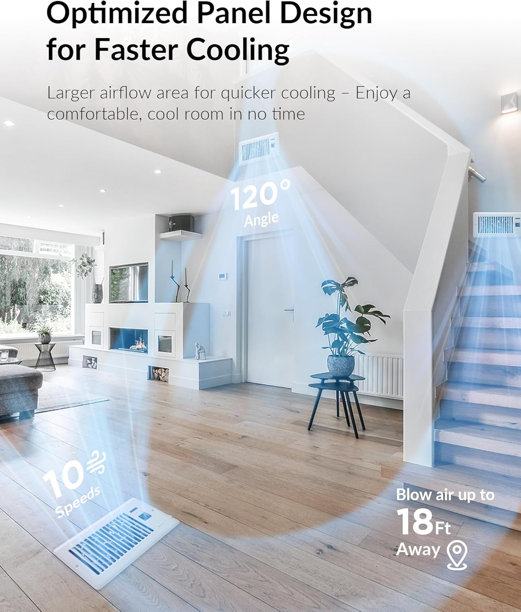
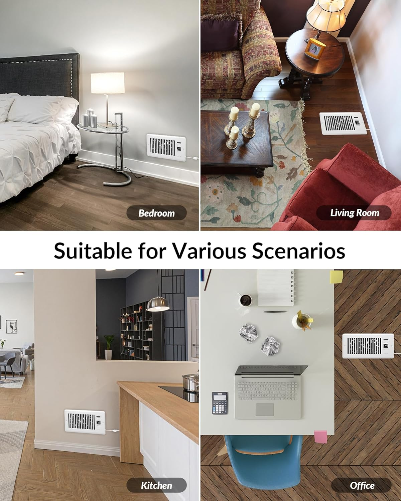

# Home Assistant HVAC Balancing


A smart HVAC room-balancing system built with **Home Assistant**, independent Zigbee temperature sensors, smart register booster fans, Nest central blower control, adaptive PI-lite logic, and live power monitoring.

The goal is to reduce temperature differences between rooms by redistributing conditioned air intelligently instead of relying only on additional heating or cooling cycles.

> **Current version: v1.2.0 — Active PI-Lite Thermal Balancing**
> The system is operational and field-tested primarily during summer / cooling conditions.

---

# Version 1.2.0

Version **v1.2.0** upgrades the three-bedroom controller from a fixed proportional airflow strategy to an **active PI-lite balancing controller**.

The original temperature-delta curve remains the proportional component (**Base P**), while a new adaptive component (**Adaptive I**) observes whether each bedroom imbalance is actually improving over time.

The final command becomes:

```text
PI Target = Base P + Adaptive I
```

with anti-windup limiting the final target to Speed 10.

## What's New in v1.2.0

- Added active PI-lite adaptive balancing for Bed 1, Bed 2, and Bed 3
- Added independent adaptive correction for each bedroom
- Added approximately 20-minute performance evaluation windows
- Added adaptive response based on measured improvement rate
- Added `reference_error` tracking for each room
- Added `last_evaluation` tracking for each room
- Added persistent control-direction tracking
- Added final PI target-speed sensors
- Active balancing now continues while the thermostat remains in `COOL` or `HEAT` mode even if the compressor or furnace is temporarily idle
- In `HEAT_COOL` mode, the active HVAC direction is retained while the system is idle
- Central Nest circulation changed from an early assist to a **second-stage assist**
- Nest circulation now starts only when any final PI target reaches **Speed 8 or higher**
- Updated five-minute central-fan release logic to use PI targets
- Added multi-panel Plotly monitoring with a shared time axis
- Added HVAC electrical power visualization using AC and indoor airflow/blower power
- Added historical fan-speed percentage visualization for all three boosters
- Added compact TV monitoring and full-screen diagnostic layouts

## Version History

| Version | Description |
|---|---|
| **v1.0.0** | Initial production controller with Bed 1 and Bed 2 balancing |
| **v1.1.0** | Added Bed 3 and expanded the controller to three independently controlled bedrooms |
| **v1.2.0** | Added active PI-lite adaptive balancing, second-stage Nest circulation, and enhanced Plotly monitoring |

---

# The Problem

Some rooms in the house consistently become warmer or cooler than others.

A central thermostat can maintain the temperature near its own reference location, but it cannot directly compensate for differences caused by factors such as:

- Different duct lengths and airflow
- Distance from the HVAC system
- Room orientation and solar exposure
- Exterior walls and windows
- Different thermal loads
- Closed bedroom doors
- Uneven supply airflow
- Different return-air paths

In this installation, the upstairs bedrooms can become significantly warmer than the Kitchen and main living areas during summer.

Simply lowering the thermostat setpoint would increase compressor runtime and may overcool other areas of the house.

The objective is therefore to improve **air distribution first**, using targeted airflow correction whenever possible.

---

# The Solution

Home Assistant continuously compares each controlled bedroom against a dedicated Kitchen reference sensor.

Each bedroom has an independently controlled register booster fan.

The controller has two layers:

```text
Base P
Temperature-driven proportional command

        +

Adaptive I
Performance-driven correction

        =

Final PI Target
```

The local bedroom booster is always the first balancing actuator.

The Nest central blower is used only as a second-stage airflow assist when local correction becomes strong enough to justify whole-system circulation.

The Nest thermostat continues to control normal heating and cooling.

Home Assistant acts as an additional:

> **Active airflow-balancing control layer**

---

# System Overview

```text
                         ┌──────────────────────┐
                         │    Nest Thermostat   │
                         │                      │
                         │ Heating / Cooling    │
                         │ Central Blower       │
                         └──────────┬───────────┘
                                    │
                                    │ HVAC mode / action
                                    │
                         ┌──────────▼───────────┐
                         │    Home Assistant    │
                         │                      │
                         │  Temperature Delta   │
                         │  Base P              │
                         │  Adaptive I          │
                         │  PI Target           │
                         │  Booster Control     │
                         │  Nest Assist         │
                         └──────┬──────┬────────┘
                                │      │
                 ┌──────────────┘      └──────────────┐
                 │                                    │
          ┌──────▼──────┐                      ┌──────▼──────┐
          │    Bed 1    │                      │    Bed 2    │
          │ Temp Sensor │                      │ Temp Sensor │
          │ Booster Fan │                      │ Booster Fan │
          └─────────────┘                      └─────────────┘
                                │
                         ┌──────▼──────┐
                         │    Bed 3    │
                         │ Temp Sensor │
                         │ Booster Fan │
                         └─────────────┘

                         Temperature Reference
                                   │
                            ┌──────▼──────┐
                            │   Kitchen   │
                            │ Temp Sensor │
                            └─────────────┘
```

Each bedroom has its own:

- Temperature sensor
- Raw temperature delta
- Base proportional target
- Adaptive correction
- Final PI target
- Effective commanded percentage
- Physical booster fan

---

# Hardware

## Register Booster Fans

Three smart HVAC register booster fans are currently installed:

- Bed 1
- Bed 2
- Bed 3

**Product:** [Smart HVAC Register Booster Fan — Amazon](https://amzn.to/45ns5bJ)

The boosters provide **10 selectable speed levels** and can be individually controlled by Home Assistant.

### Booster Fan Photos

<p align="center">
  
</p>

<p align="center">
  
  
</p>

<p align="center">
  
  
</p>

<p align="center">
  
  
</p>

---

## Temperature Sensors

Temperature measurements used by the balancing controller come from dedicated **Zigbee 3.0 temperature and humidity sensors**.

**Sensor used in this project:**  
[Zigbee 3.0 Temperature & Humidity Sensor — Amazon](https://amzn.to/4czY3p1)

The same sensor model is used in:

- Kitchen
- Bed 1
- Bed 2
- Bed 3

Using the same sensor model in all controlled locations is intentional because the controller is primarily interested in **temperature difference between rooms**.

### Temperature Entities

| Location | Function | Entity |
|---|---|---|
| Kitchen | Main balancing reference | `sensor.kitchen_temp_temperature` |
| Bed 1 | Controlled bedroom | `sensor.bed_1_temp_temperature` |
| Bed 2 | Controlled bedroom | `sensor.bed_2_temp_temperature` |
| Bed 3 | Controlled bedroom | `sensor.bed_3_temp_temperature` |

---

# Tuya Integration

The booster fans are Tuya-based Wi-Fi devices.

The official Home Assistant Tuya integration did not expose all controls required by this booster model, so this project uses **Xtend Tuya**.

Project repository:

[azerty9971/xtend_tuya on GitHub](https://github.com/azerty9971/xtend_tuya)

Xtend Tuya exposed the required controls for:

- Fan power
- FAN preset mode
- Percentage / speed control
- Native `fan` entity commands

## Xtend Tuya Limitations Observed

At the time of implementation in **August 2026**, command delivery was reliable, but reported device state could occasionally remain stale.

Potentially stale feedback included:

- Current speed
- Fan percentage
- Preset mode
- Some Tuya select entities

For this reason:

> **Home Assistant is treated as the source of truth for the desired booster state.**

---

# Booster Command Sequence

Testing showed that the boosters accept preset and percentage commands while powered OFF.

Whenever a booster needs to run, Home Assistant uses this sequence:

```text
Set FAN mode
     │
     ▼
Wait 1 second
     │
     ▼
Set desired percentage
     │
     ▼
Wait 1 second
     │
     ▼
Turn booster ON
```

The speed mapping is:

| Booster Level | HA Percentage |
|---:|---:|
| 1 | 10% |
| 2 | 20% |
| 3 | 30% |
| 4 | 40% |
| 5 | 50% |
| 6 | 60% |
| 7 | 70% |
| 8 | 80% |
| 9 | 90% |
| 10 | 100% |

If no airflow is required, Home Assistant sends an OFF command.

---

# Temperature Sensing

## Temperature Reference

The dedicated Kitchen Zigbee sensor is the balancing reference.

The controller intentionally compares Kitchen, Bed 1, Bed 2, and Bed 3 using the same sensor model instead of using the Nest thermostat temperature as the primary balancing reference.

---

## Raw Temperature Delta

Home Assistant calculates:

```text
Bedroom Temperature - Kitchen Temperature
```

Template entities:

```text
sensor.bed_1_temperature_delta
sensor.bed_2_temperature_delta
sensor.bed_3_temperature_delta
```

| Raw Delta | Meaning |
|---:|---|
| Positive | Bedroom is warmer than Kitchen |
| 0°F | Temperatures are equal |
| Negative | Bedroom is cooler than Kitchen |

---

# Directional Control Error

The raw delta always represents:

```text
Bedroom - Kitchen
```

but the balancing demand changes direction depending on thermostat mode.

## COOL mode

```text
Control Error = Bedroom - Kitchen
```

A warmer bedroom creates positive airflow demand.

## HEAT mode

```text
Control Error = Kitchen - Bedroom
```

A colder bedroom creates positive airflow demand.

## HEAT_COOL mode

When `hvac_action` is actively `cooling` or `heating`, that action establishes the current direction.

When the thermostat remains in `heat_cool` but becomes idle, v1.2 retains the most recently known heating/cooling direction so active thermal balancing can continue between compressor/furnace cycles.

---

# Active Thermal Balancing

A major v1.2 change is that balancing is based primarily on **thermostat operating mode**, not only on active compressor/furnace runtime.

For example, while the Nest remains in `COOL` mode:

```text
Bedroom warmer than Kitchen
          │
          ▼
Balancing demand remains active
          │
          ▼
Bedroom booster may continue running
```

This remains true even when:

```text
hvac_action = idle
```

That allows the system to continue redistributing already-conditioned air and can improve equalization between normal AC cycles.

The same concept applies in `HEAT` mode with the error direction reversed.

---

# Base P — Proportional Controller

The original temperature-based controller remains the proportional component of the new PI-lite architecture.

Entities:

```text
sensor.bed_1_booster_target_speed
sensor.bed_2_booster_target_speed
sensor.bed_3_booster_target_speed
```

## Base Speed Curve

| Directional Error | Base P |
|---:|---:|
| `< 1.5°F` | 0 |
| `1.5 – <2.0°F` | 2 |
| `2.0 – <2.5°F` | 4 |
| `2.5 – <3.0°F` | 6 |
| `3.0 – <3.5°F` | 8 |
| `≥ 3.5°F` | 10 |

Examples:

```text
1.7°F → Base P 2
2.2°F → Base P 4
2.7°F → Base P 6
3.2°F → Base P 8
3.5°F → Base P 10
```

## Hysteresis

The proportional controller keeps approximately **0.2°F hysteresis** when reducing demand.

| Rising Threshold | Base P | Falling Threshold |
|---:|---:|---:|
| 1.5°F | 2 | ≤ 1.3°F → 0 |
| 2.0°F | 4 | ≤ 1.8°F → 2 |
| 2.5°F | 6 | ≤ 2.3°F → 4 |
| 3.0°F | 8 | ≤ 2.8°F → 6 |
| 3.5°F | 10 | ≤ 3.3°F → 8 |

---

# Adaptive I — PI-Lite Correction

The proportional controller can determine how serious the current imbalance is, but it cannot determine whether the selected airflow is actually solving the problem fast enough.

v1.2 adds an adaptive correction for each bedroom:

```text
sensor.bed_1_booster_adaptive_boost
sensor.bed_2_booster_adaptive_boost
sensor.bed_3_booster_adaptive_boost
```

The adaptive controller wakes every **5 minutes**, but changes its correction only after approximately **20 minutes** of observation.

Each room tracks:

- Current directional error
- Reference error from the previous evaluation window
- Last evaluation timestamp
- Current control direction
- Current adaptive correction

## 20-Minute Adaptive Response

After approximately 20 minutes:

| Improvement during window | Adaptive response |
|---:|---|
| `< 0.2°F` | Increase Adaptive I by 1 |
| `0.2 – <0.5°F` | Hold current Adaptive I |
| `≥ 0.5°F` | Reduce Adaptive I by 1 |

Conceptually:

```text
Reference Error
      -
Current Error
      =
Improvement
```

Example:

```text
Reference error = 3.0°F
Current error   = 2.9°F
Improvement     = 0.1°F

Result: airflow is not correcting fast enough
        → Adaptive I +1
```

Another example:

```text
Reference error = 3.0°F
Current error   = 2.4°F
Improvement     = 0.6°F

Result: room is responding well
        → Adaptive I -1
```

## Adaptive Reset / Unwind Rules

The adaptive correction is removed or reduced when appropriate:

- Thermostat operating direction changes
- A required temperature sensor is unavailable
- Directional error reaches **1.3°F or less**
- Base P is already Speed 10 and no additional headroom exists
- When the error is between roughly **1.3°F and 1.5°F**, the adaptive correction unwinds one step at each evaluation

## Anti-Windup

The controller never allows the adaptive term to push the final command beyond Speed 10.

```text
Adaptive Headroom = 10 - Base P
```

---

# Final PI Target

The final controller target is:

```text
PI Target = Base P + Adaptive I
```

limited to:

```text
Maximum = Speed 10
```

Entities:

```text
sensor.bed_1_booster_pi_target_speed
sensor.bed_2_booster_pi_target_speed
sensor.bed_3_booster_pi_target_speed
```

Example:

```text
Base P      = 6
Adaptive I  = 2
----------------
PI Target   = 8
```

This allows a moderate temperature imbalance that is not improving fast enough to progressively request more local airflow.

---

# Effective Booster Percentage

The final percentage intended for each physical booster is exposed through:

```text
sensor.bed_1_booster_effective_percentage
sensor.bed_2_booster_effective_percentage
sensor.bed_3_booster_effective_percentage
```

The PI target normally maps directly to percentage:

```text
Speed 4 → 40%
Speed 6 → 60%
Speed 8 → 80%
Speed 10 → 100%
```

## HVAC-Active Minimum Speed

When the HVAC is actively heating or cooling, all three boosters run at a minimum of:

> **Speed 1 / 10%**

Conceptually:

```text
if hvac_action = cooling or heating:
    Effective Speed = max(PI Target, 1)
else:
    Effective Speed = PI Target
```

This minimum rule applies only while the central HVAC is actively producing conditioned air.

The PI balancing target itself may remain active while `hvac_action` is idle.

---

# Central Nest Blower — Second-Stage Assist

v1.2 changes the central blower strategy significantly.

In v1.1, the Nest blower joined relatively early in the balancing process.

In v1.2, the local booster gets the first opportunity to correct the imbalance.

The Nest blower is requested only when **any final PI target reaches Speed 8 or higher**.

```text
Bed 1 PI Target >= 8
        OR
Bed 2 PI Target >= 8
        OR
Bed 3 PI Target >= 8
        │
        ▼
Request Nest circulation
```

Example:

```text
Base P = 6
Adaptive I = 0 → PI 6 → booster only
Adaptive I = 1 → PI 7 → booster only
Adaptive I = 2 → PI 8 → Nest circulation joins
```

A severe imbalance that already produces Base P 8 or 10 requests central circulation immediately.

The implementation uses a renewable **12-hour Nest fan timer** while strong balancing demand exists.

---

# Five-Minute Central-Fan Release

When all three PI targets fall below Speed 8, independent central circulation is not stopped immediately.

The controller waits:

> **5 minutes**

and then re-checks the current PI targets.

```text
All PI Targets < 8
       │
       ▼
Wait 5 minutes
       │
       ▼
Re-check live PI targets
       │
   ┌───┴──────────┐
   │              │
Demand returned   Still < 8
   │              │
   ▼              ▼
Keep circulation  Stop independent
                  Nest circulation
```

The automation uses:

```text
mode: restart
```

so new demand during the delay restarts the automation and prevents a stale shutdown decision.

---

# Automatic Recovery and Reconciliation

The main automation reacts when:

- Bed 1 PI target changes
- Bed 2 PI target changes
- Bed 3 PI target changes
- Nest `hvac_action` changes
- Thermostat operating mode changes

It also runs:

- On Home Assistant startup
- Once per hour for reconciliation

This helps recover from:

- Missed Tuya commands
- Temporary integration issues
- Booster reboot
- Home Assistant restart
- Stale feedback
- Nest fan timer expiration

---

# v1.2 Control Flow

Each bedroom follows the same control pipeline:

```text
Bedroom Temperature
        │
        ▼
Directional Temperature Error
        │
        ▼
Base P
        │
        ├─────────────┐
        │             │
        ▼             ▼
20-minute        Current Error
Reference Error      │
        │             │
        └──────┬──────┘
               ▼
          Adaptive I
               │
               ▼
     PI Target = P + I
               │
               ▼
   HVAC Active Minimum Rule
               │
               ▼
     Effective Percentage
               │
               ▼
       Physical Booster
```

The three independent room controllers share:

- Kitchen reference temperature
- Thermostat mode/direction
- Nest second-stage circulation decision

---

# Energy Monitoring

HVAC electrical consumption is monitored separately for the outdoor AC equipment and indoor furnace/blower circuit.

Primary entities used by the dashboard:

```text
sensor.ac_power_total
sensor.furnace_power_total
```

The second sensor is displayed in the dashboard as **Airflow**, because in this installation it provides a useful view of indoor blower/circulation activity.

Observed values are installation-specific, but historical measurements showed the central blower consumes substantially less power than the outdoor compressor.

This supports the core optimization idea:

> **Use airflow redistribution when practical before asking the compressor to do additional work.**

---

# Monitoring and Diagnostics

v1.2 introduces a significantly expanded monitoring interface.

The current live dashboard exposes:

- Current AC status
- Bed 1 / Bed 2 / Bed 3 temperatures
- Raw ΔT values
- Base P command
- Adaptive I correction
- 20-minute reference error
- Last PI evaluation time
- Final PI target
- Effective fan percentage
- AC electrical power
- Indoor airflow/blower electrical power
- Historical room temperatures
- Historical temperature deltas
- Historical fan-speed percentages

---

## Plotly Multi-Panel Dashboard

The primary v1.2 visualization uses **Plotly Graph Card** with multiple vertically stacked plots sharing the same time axis.

The dashboard is organized as:

```text
1. HVAC Power
   AC power + Airflow/blower power

2. Temperatures
   AC temperature + Target + Kitchen + Bed 1 + Bed 2 + Bed 3

3. Delta
   Bed 1 ΔT + Bed 2 ΔT + Bed 3 ΔT

4. Fan Speed
   Bed 1 + Bed 2 + Bed 3 effective fan percentage
```

This makes it possible to visually correlate:

```text
HVAC activity
      ↓
Temperature response
      ↓
Room imbalance
      ↓
Booster response
```

Two versions are currently used:

- Compact 48-hour TV monitoring layout
- Larger full-screen diagnostic layout with a longer history window

---

## Live Status Table

A compact live table shows all three rooms side-by-side.

Typical rows include:

```text
Temperature
Delta
Base P
Adaptive I
Reference Error
Last Evaluation
PI Target
Fan %
```

This makes the controller state readable at a glance without opening individual entities.

---

# Dashboard Dependencies

Depending on which included dashboard layout is used, the current UI may require custom Lovelace cards including:

- `plotly-graph-card`
- `multiple-entity-row`
- `card-mod`

Earlier diagnostic views also use `apexcharts-card`.

---

# Home Assistant Configuration

The project configuration is stored in the `HomeAssistant/` directory.

| File | Purpose |
|---|---|
| [`HomeAssistant/templates.yaml`](HomeAssistant/templates.yaml) | Temperature delta, Base P, Adaptive I, PI target, and effective-percentage template sensors |
| [`HomeAssistant/automation.yaml`](HomeAssistant/automation.yaml) | Three-bedroom booster control and second-stage Nest circulation |
| [`HomeAssistant/dashboard.yaml`](HomeAssistant/dashboard.yaml) | Monitoring, Plotly visualization, and diagnostics |
| [`HomeAssistant/README.md`](HomeAssistant/README.md) | Installation and implementation notes |

---

# Core v1.2 Entities

## Temperature

```text
sensor.kitchen_temp_temperature
sensor.bed_1_temp_temperature
sensor.bed_2_temp_temperature
sensor.bed_3_temp_temperature
```

## Raw Temperature Delta

```text
sensor.bed_1_temperature_delta
sensor.bed_2_temperature_delta
sensor.bed_3_temperature_delta
```

## Base P

```text
sensor.bed_1_booster_target_speed
sensor.bed_2_booster_target_speed
sensor.bed_3_booster_target_speed
```

## Adaptive I

```text
sensor.bed_1_booster_adaptive_boost
sensor.bed_2_booster_adaptive_boost
sensor.bed_3_booster_adaptive_boost
```

Adaptive sensor attributes include:

```text
directional_error
reference_error
last_evaluation
control_direction
```

## Final PI Target

```text
sensor.bed_1_booster_pi_target_speed
sensor.bed_2_booster_pi_target_speed
sensor.bed_3_booster_pi_target_speed
```

## Effective Percentage

```text
sensor.bed_1_booster_effective_percentage
sensor.bed_2_booster_effective_percentage
sensor.bed_3_booster_effective_percentage
```

## Booster Fans

```text
fan.bed_1_booster
fan.bed_2_booster
fan.bed_3_booster
```

## Central HVAC

```text
climate.kitchen
```

## HVAC Power Monitoring

```text
sensor.ac_power_total
sensor.furnace_power_total
```

---

# Repository Structure

```text
home-assistant-hvac-balancing/
│
├── README.md
│
├── Photos/
│   ├── home-assistant-hvac-balancing.png
│   ├── HVAC Smart Booster - Live Status.png
│   ├── Booster Controller.png
│   ├── Temperature Balance.png
│   ├── XTend Tuya Register Booster Fan integration.png
│   │
│   ├── automation/
│   │   ├── 1.png
│   │   ├── 2.png
│   │   ├── 3.png
│   │   └── 4.png
│   │
│   └── products/
│       └── booster product photos
│
└── HomeAssistant/
    ├── README.md
    ├── templates.yaml
    ├── automation.yaml
    └── dashboard.yaml
```

---

# Current Status

The v1.2 controller is operational and currently being observed under real-world summer conditions.

The active system includes:

```text
Bed 1 Booster
       +
Bed 2 Booster
       +
Bed 3 Booster
       +
Active PI-Lite Balancing
       +
Central Nest Blower Second-Stage Assist
       +
HVAC Power Monitoring
```

The Kitchen remains the main room-balancing temperature reference.

---

# Current Implementation Checklist

## Summer / Cooling

- [x] Matching temperature sensors in Kitchen, Bed 1, Bed 2, and Bed 3
- [x] Kitchen reference temperature
- [x] Three bedroom temperature-delta sensors
- [x] Directional cooling/heating control architecture
- [x] Three independent Base P targets
- [x] 0.2°F proportional hysteresis
- [x] Three independent Adaptive I controllers
- [x] 20-minute performance-reference windows
- [x] Adaptive correction based on measured improvement
- [x] Anti-windup at Speed 10
- [x] Final PI target sensors
- [x] Effective-percentage sensors
- [x] Active balancing while COOL/HEAT mode remains selected even when HVAC is idle
- [x] Minimum Speed 1 while HVAC is actively heating or cooling
- [x] Nest second-stage assist at PI Target >= 8
- [x] Five-minute Nest circulation release delay
- [x] Home Assistant restart recovery
- [x] Hourly desired-state reconciliation
- [x] Xtend Tuya command validation
- [x] HVAC power monitoring
- [x] Multi-panel Plotly dashboard
- [x] Fan-speed history visualization
- [x] Compact TV dashboard
- [x] Full-screen diagnostic dashboard
- [x] Real-world summer operation in progress

## Winter / Heating

- [ ] Winter thermal behavior measured
- [ ] Heating-specific adaptive behavior validated
- [ ] Basement temperature monitoring re-established for winter testing
- [ ] Basement imbalance characterized
- [ ] Basement booster evaluated
- [ ] Heating-specific thresholds tuned if required
- [ ] Central circulation strategy validated for heating
- [ ] Interaction between upstairs and basement balancing tested
- [ ] Winter energy impact measured
- [ ] Heating configuration field-tested

---

# Future Development

## Longer-Term PI Performance Validation

The adaptive controller should be evaluated over longer periods using metrics such as:

- Average bedroom ΔT
- Maximum daily ΔT
- Time above 1.5°F imbalance
- Time above 2.0°F imbalance
- Average equalization time
- Adaptive steps added per room
- Booster runtime per room
- Nest circulation runtime
- Compressor runtime
- Percentage of time within desired tolerance

These metrics can help determine whether the current 20-minute adaptive window and improvement thresholds are optimal.

---

## Independent Room Tuning

All three bedrooms currently use the same Base P and Adaptive I rules.

Future versions may tune rooms independently because they differ in:

- Duct length
- Register size
- Room volume
- Exterior exposure
- Solar load
- Insulation
- Return-air path
- Distance from the central blower

---

## Winter / Heating Balancing

The next seasonal phase is to validate the architecture under winter heating conditions.

The expected house behavior may be approximately the opposite of summer:

```text
SUMMER
Upstairs bedrooms too warm
        ↓
Increase airflow upstairs

WINTER
Basement too cold
        ↓
Potentially increase airflow downstairs
```

A future whole-house version may include dedicated basement sensing and booster control.

---

## Occupancy-Aware Balancing

Occupancy could eventually become another input:

```text
Temperature Demand
        +
PI Performance
        +
HVAC State
        +
Occupancy
        │
        ▼
Airflow Priority
```

This could reduce unnecessary balancing in unused rooms.

---

## Energy Optimization

Future versions could directly compare:

```text
Temperature imbalance
        +
Booster activity
        +
Central blower consumption
        +
Compressor consumption
```

with the objective:

> **Maintain acceptable room balance using the least additional energy.**

Possible decisions could include:

- Booster only
- Booster + central circulation
- Wait for the next HVAC cycle
- Higher airflow for a shorter period
- Lower airflow for a longer period

---

# Long-Term Goal

The long-term objective is a season-aware controller capable of determining:

1. Which rooms are outside the desired thermal balance
2. Which direction requires correction
3. What proportional airflow is appropriate
4. Whether the current airflow is actually correcting the imbalance
5. Whether adaptive correction is necessary
6. Whether central circulation is useful
7. When correction should unwind or stop
8. Whether another strategy could deliver equal comfort using less energy

Conceptually:

```text
Room Temperatures
        +
HVAC Operating Mode
        +
Measured Response
        +
Power Consumption
        +
Historical Performance
        │
        ▼
   Home Assistant
        │
        ▼
Adaptive Airflow Strategy
        │
   ┌────┼────┐
   ▼    ▼    ▼
 Bed 1 Bed 2 Bed 3
   │    │    │
   └────┴────┘
        │
        ▼
Optional Central Blower Assist
        │
        ▼
Measure Result
        │
        ▼
Optimize Next Decision
```

v1.2 is the first production step in which the controller evaluates not only **how large the imbalance is**, but also **whether the selected airflow is actually fixing it**.

---

# Disclaimer

This project documents a personal Home Assistant HVAC automation system.

HVAC equipment, duct design, blower capacity, static pressure, electrical systems, and building characteristics vary significantly between installations.

Register booster fans and changes to airflow distribution should be used carefully.

Avoid significantly restricting supply or return airflow.

Do not close large numbers of supply registers in an attempt to force air toward other rooms.

If system airflow, static pressure, or equipment limitations are uncertain, consult a qualified HVAC professional.

This repository is intended as a reference and experimentation project rather than a universal HVAC configuration.